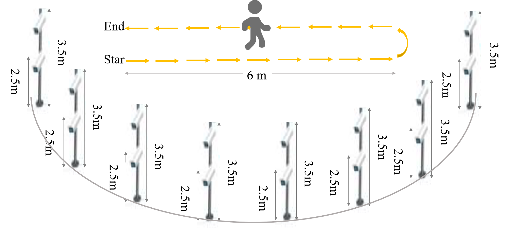

# D-Gait

Depression risk recognition based on gait: A benchmark


------

### Highlights in D-Gait Dataset

**(1) Large Data Scale**

The D-Gait dataset comprises 27,120 gait sequences collected from 292 volunteers. This extensive sample size provides robust support for data-driven methodologies.

**(2) Comprehensive Diversity**

The D-Gait dataset accounts for a wide range of shooting angles and clothing variations. Specifically, it features 16 uniformly distributed shooting angles from 0 to 180 degrees. Clothing variations include not only normal walking patterns but also factors such as walking with bags and walking in different clothing.

**(3) Reliability of Label**

 The reliability of the D-Gait dataset labels is ensured through the integration of three professional diagnostic scales: SDS, PHQ-9, and GAD-7. This approach significantly enhances the accuracy and reliability of the labels.


### Data Collection

 


 This dataset includes **silhouette** and **skeleton** data versions, but it is essential to note that it is **ACADEMIC USE ONLY**.

------

### Download D-Gait

To obtain and use this dataset and its subsets, all users are required to complete the following steps:

1. Download the latest agreement and complete it.
2. Submit it to [BNU-IVC_D-Gait@outlook.com](mailto:BNU-IVC_D-Gait@outlook.com) .

We will handle your requests within a week. In case you encounter any issues, please feel free to reach out to us via [BNU-IVC_D-Gait@outlook.com](mailto:BNU-IVC_D-Gait@outlook.com).


## Citation
Please cite the following paper if you find this useful in your research:


```BibTeX
@article{liu2024depression,
  title={Depression risk recognition based on gait: A benchmark},
  author={Liu, Xiaotong and Li, Qiong and Hou, Saihui and Ren, Min and Hu, Xuecai and Huang, Yongzhen},
  journal={Neurocomputing},
  pages={128045},
  year={2024},
  publisher={Elsevier}
}
```
